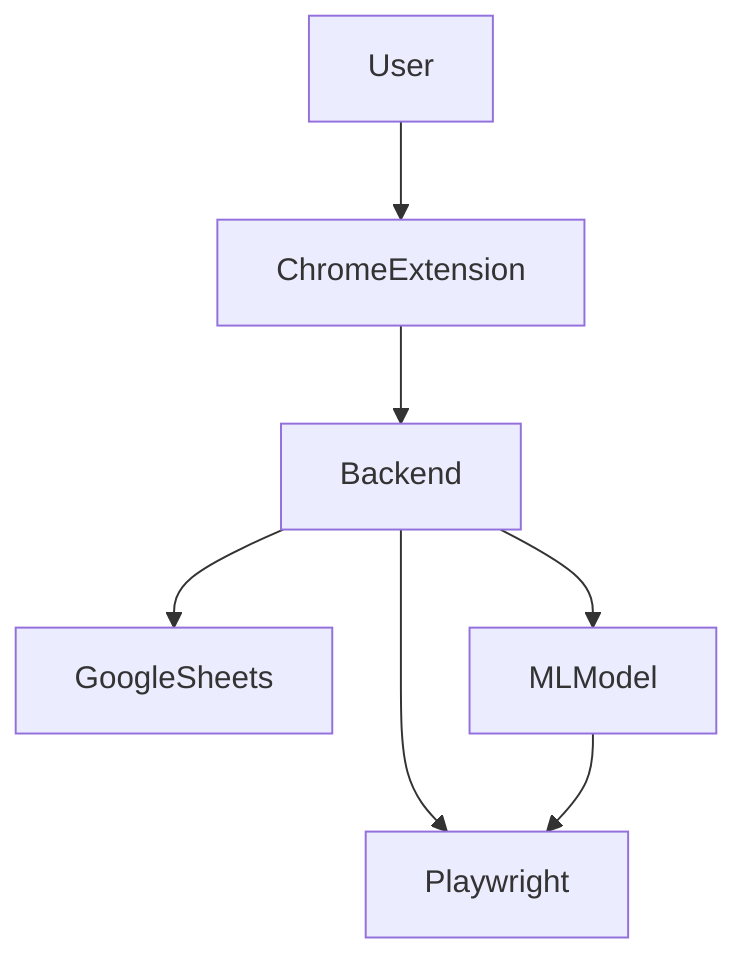

# System Overview

## Core Features
1. **Automated Form Filling**:
   - Chrome extension parses pages and sends data to the backend.
   - Backend predicts form fields using ML and automates completion via Playwright.

2. **Job Tracking**:
   - Tracks all applications in a centralized Google Sheets document.
   - Stores key data like company, job title, location, recruiter contact, and application status.

3. **Dashboard**:
   - React-based interface for inputting personal details, managing applications, and viewing analytics.

4. **Extensibility**:
   - Designed to accommodate future features like alumni networking and recruiter suggestions.

## High-Level Architecture

