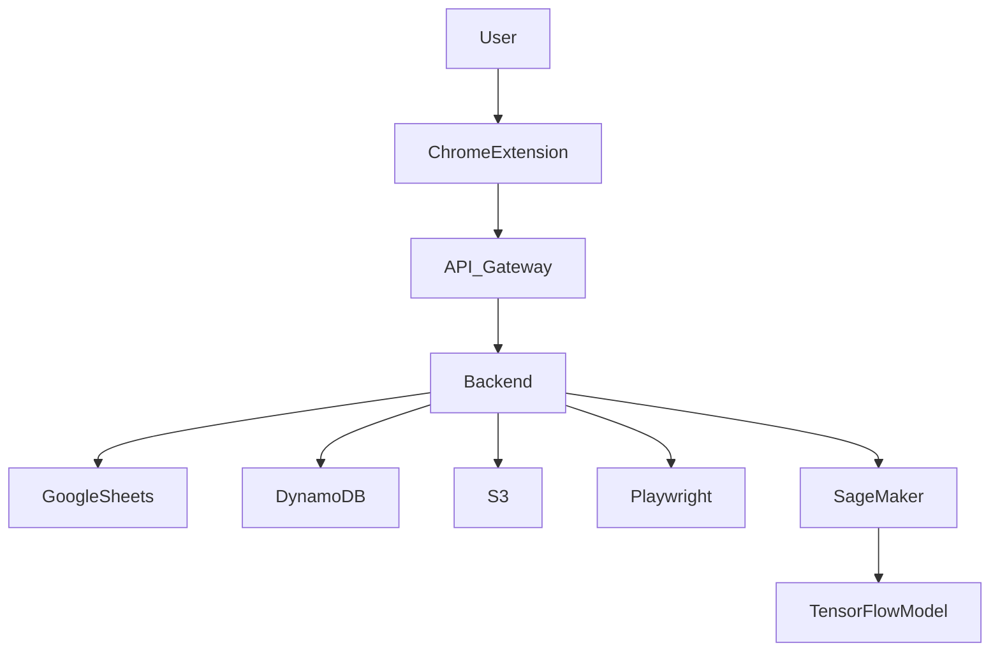
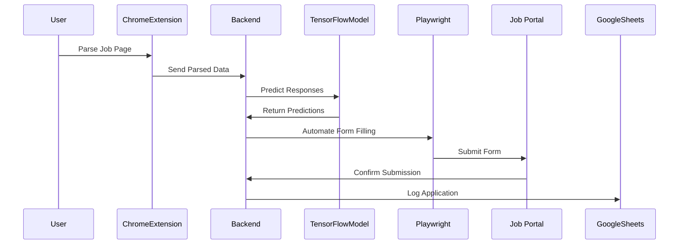
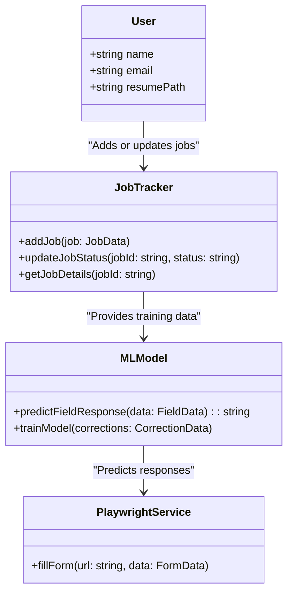
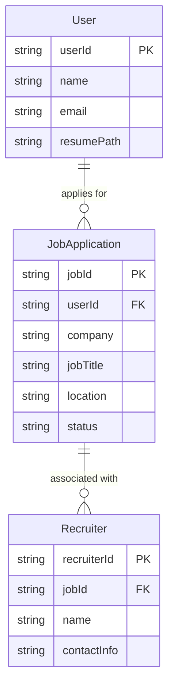
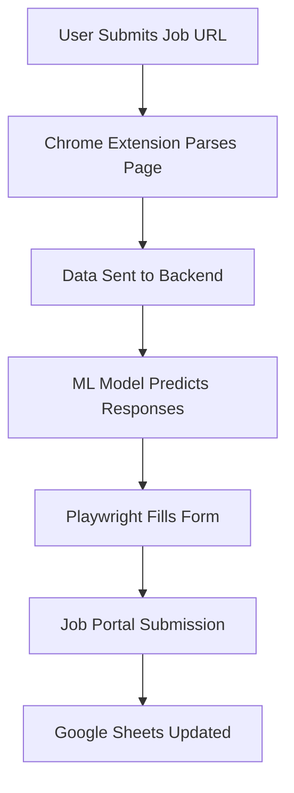

# Architecture Diagrams

## High-Level System Architecture:

## Sequence Diagram: Form Filling Workflow

## Class Diagram: Core System Components:

## ER Diagram: Data Relationships

## Activity Diagram: Form Filling Workflow

