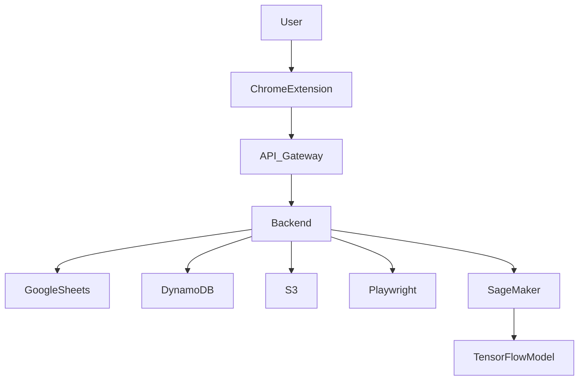
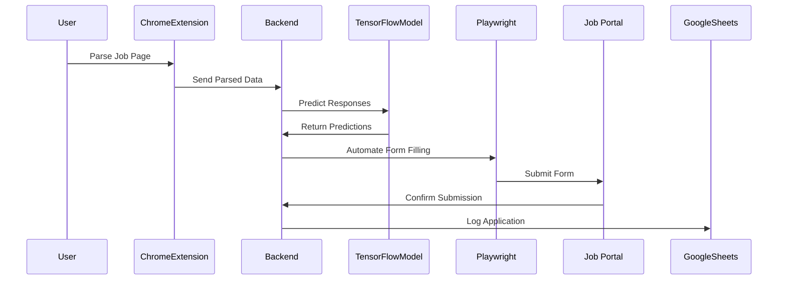
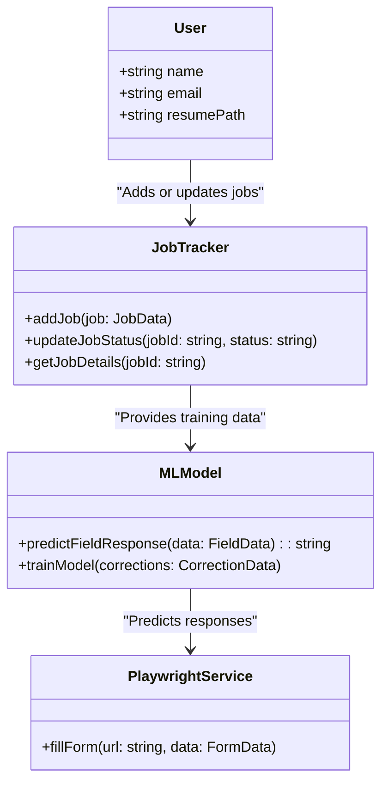
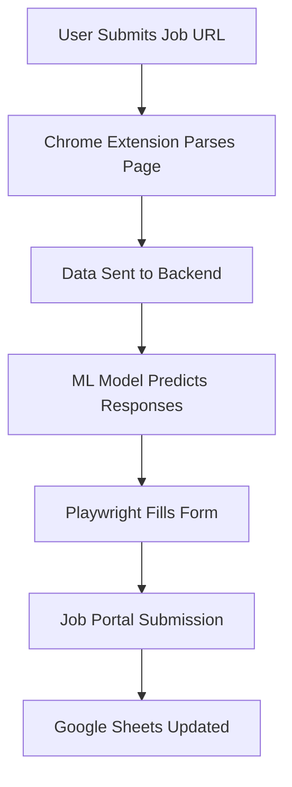

# **CV Filler Bot - Software Design Document**

## **1. Introduction**

The **CV Filler Bot** is a job application automation tool that automates form filling, job tracking, and AI-powered predictions to optimize the job application process.

## **2. Objectives**

1. Automate job application form filling dynamically.
2. Provide a React-based dashboard for tracking and managing applications.
3. Use AI/ML models to improve auto-filling accuracy.
4. Integrate with Google Sheets API for application tracking.
5. Deploy on AWS for scalability.

---

## **3. System Overview**

### **Core Features**

1. **Automated Form Filling**
    
    - Chrome extension extracts job portal data and sends it to the backend.
    - Playwright automates form completion and submission.
2. **Job Tracking**
    
    - Uses Google Sheets API to store applications.
    - Stores company, job title, location, recruiter contact, and application status.
3. **Dashboard**
    
    - React-based UI for inputting personal details and tracking job applications.
4. **AI-Powered Predictions**
    
    - Uses AWS SageMaker for ML-based form predictions.
    - Queries external LLMs for additional responses.

---

## **4. Tech Stack**

### **Frontend:**

- React.js (UI for tracking applications)
- Vite (Fast build system for React frontend)
- AWS S3 + CloudFront (Hosting)
- Chrome Extension (Data extraction from job portals)

### **Backend:**

- FastAPI (Handles requests from frontend & Chrome extension)
- Playwright (For web automation & form filling)
- AWS Lambda / EC2 (Backend deployment)

### **Storage:**

- Google Sheets API (Application tracking)
- AWS DynamoDB (User data storage)

### **AI & Automation:**

- AWS SageMaker (ML model for predicting form fields)
- TensorFlow (Training user-specific models)
- External LLM APIs (For smart application responses)

---

## **5. System Architecture**



---

## **6. Workflow Diagrams**

### **6.1 Sequence Diagram - Form Filling Workflow**



### **6.2 Class Diagram - Core System Components**



### **6.3 Activity Diagram - Form Filling Workflow**



---

## **7. Git & GitHub Workflow**

1. **Initialize the Repository**
    
    ```bash
    git init
    git branch -M main
    git remote add origin <your-repo-url>
    ```
    
2. **Feature Branching**
    
    - Create a branch for each feature:
        
        ```bash
        git checkout -b feature/front-end
        ```
        
    - Push changes:
        
        ```bash
        git add .
        git commit -m "Initialized React frontend with Vite"
        git push origin feature/front-end
        ```
        
    - Create a Pull Request (PR) and merge once reviewed.
3. **Commit Stages**
    
    - **Project setup** → Initial commit.
    - **Feature development** → Feature-specific commits.
    - **Testing & Integration** → After API connections are validated.
    - **Deployment** → Final commits before pushing to AWS.

---

## **8. Deployment Strategy**

### **Frontend Deployment**

1. **React Dashboard (Vite-based)**:
    
    ```bash
    npm run build
    aws s3 sync build/ s3://<your-bucket-name>
    ```
    
2. **Configure CloudFront for distribution**

### **Backend Deployment**

1. **FastAPI Backend**:
    
    ```bash
    pip install -r requirements.txt
    zip -r backend.zip .
    ```
    
2. **Deploy to AWS Lambda or EC2**

### **Machine Learning Deployment**

1. **Train & Deploy ML Model on SageMaker**
2. **Query predictions via an API**

### **Monitoring**

- **AWS CloudWatch** for logging backend & automation scripts.
- **Monitor SageMaker** endpoints for model performance.

---

## **9. Risks and Mitigations**

|**Risk**|**Cause**|**Mitigation**|
|---|---|---|
|**Inaccurate Predictions**|Insufficient ML training data|Use user feedback for retraining.|
|**AWS Free Tier Overuse**|High operational load|Monitor resources with AWS CloudWatch.|
|**Parsing Failures**|Job portal layout changes|Implement dynamic selectors & logging.|

---

## **10. Future Enhancements**

1. **Recruiter Suggestions**
    - LinkedIn scraping for relevant recruiters.
2. **Alumni Tracking**
    - Connect with alumni based on job applications.
3. **AI-Generated Cover Letters**
    - Use LLMs for customized cover letters.

---

## **11. Next Steps**

1. **Set up frontend React structure with Vite**.
2. **Initialize FastAPI backend with a test API endpoint**.
3. **Test frontend-backend connection**.
4. **Begin implementing Playwright automation**.

---

This document will be updated as development progresses. Let me know when you are ready to start implementation!